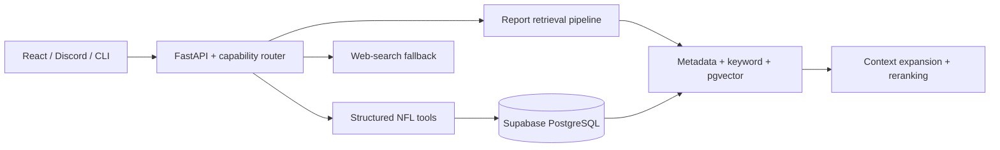

# MAGIFF

MAGIFF is an evidence-grounded fantasy football research and roster-management
assistant. It combines structured NFL data, current reports, live league
context, and web search to answer statistical, news, draft, waiver, and lineup
questions without relying on model memory alone.

## Highlights

- Routes each question to structured tools, report retrieval, web search, or a
  combination of those capabilities.
- Uses metadata-aware keyword and pgvector search, grounded entity resolution,
  contextual retrieval, evidence gating, and LLM reranking for report research.
- Supports safe formula-based player and team analysis over normalized NFL data
  and historical/current fantasy ECR.
- Builds read-only Sleeper league context for draft, waiver, and lineup advice,
  including league-scored projections, injury news, legal roster validation,
  and kickoff-aware Discord alerts.
- Continuously ingests, normalizes, deduplicates, embeds, and versions fantasy
  reports through scheduled GitHub Actions.

In an internal benchmark spanning fantasy advice, news, and statistics, MAGIFF
produced a **7.4% improvement in judged answer accuracy** and a **16.7% average
reduction in token cost** compared with a web-search-only baseline.

## Architecture



The backend is Python 3.13 with FastAPI, Pydantic, PostgreSQL, pgvector, and the
OpenAI API. The web client uses React, TypeScript, and Vite. Production services
run on Render, Supabase, Vercel, and GitHub Actions.

## Local development

Create the backend environment and install dependencies:

```bash
python3.13 -m venv backend/.venv
source backend/.venv/bin/activate
pip install -r backend/requirements.txt
cp .env.example .env
```

Fill in the required values in `.env`, apply the Supabase migrations, and start
the API:

```bash
npx supabase db push
cd backend
uvicorn api.app:app --reload
```

In another terminal, start the web client:

```bash
cd frontend
npm install
npm run dev
```

Run the regression suite with:

```bash
cd backend
.venv/bin/python -m unittest discover -s tests -q
```

See [backend/README.md](backend/README.md),
[backend/rag/README.md](backend/rag/README.md), and
[frontend/README.md](frontend/README.md) for subsystem details and deployment
configuration.

## Safety and data

Secrets, raw provider data, processed datasets, and local retrieval caches are
excluded from Git. Sleeper integrations use public read-only data; draft,
waiver, and lineup workflows generate validated recommendations but do not
submit roster mutations.
